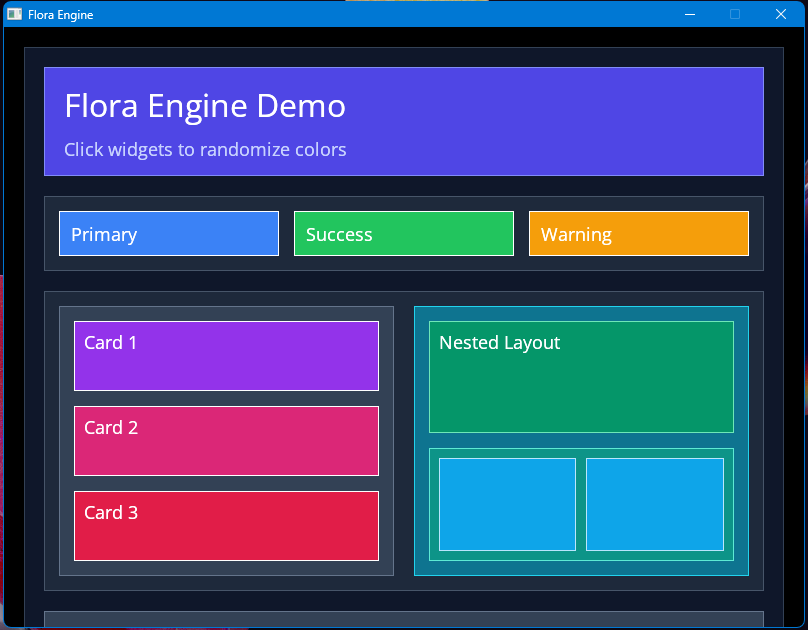

# Flora Engine

Flora Engine is a 2D UI engine

## Build Instructions

This project uses Cmake and can be used on multiple platforms provided you have the necessary dependencies.

### Dependencies
- SDL3
- SDL3_TTF
- MinGW (Windows)

Before building check the TODO(s) in the cmakelists.txt file.

### Building on Windows

```
cmake -B build -G "MinGW Makefiles"
cmake --build build
```

### Building on Linux
```
cmake -B build
cmake --build build
```

## Capabilities

Currently, the flora engine is able to do the following:

- layout widgets (boxes) with two layout modes: left-to-right and top-to-bottom
- handle and dispatch events to widgets
- render text

This image shows a demo screen rendered using flora engine:



Flora is still in development, so look out for new features.